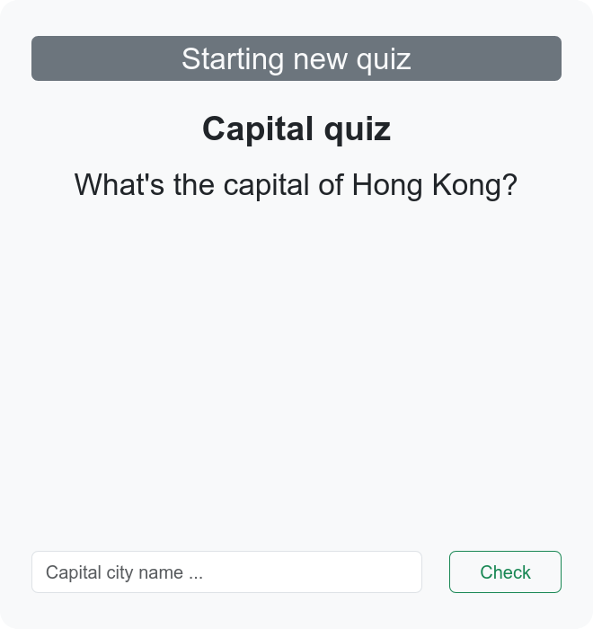
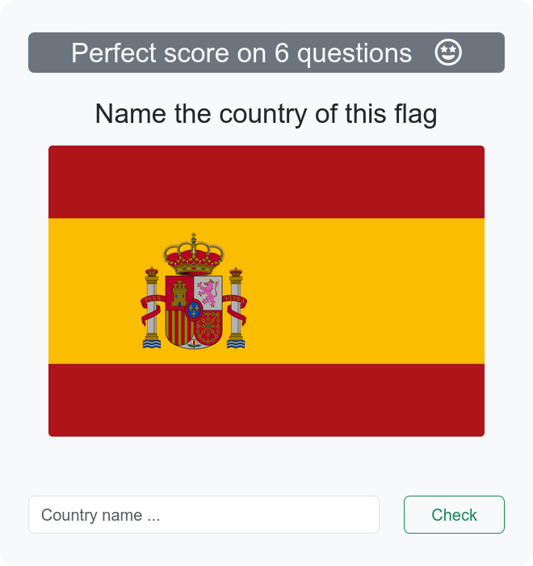
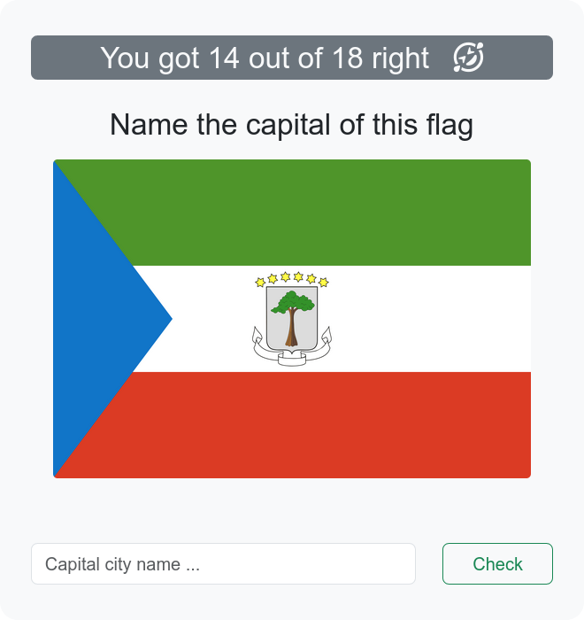
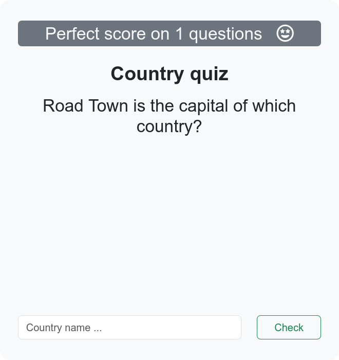
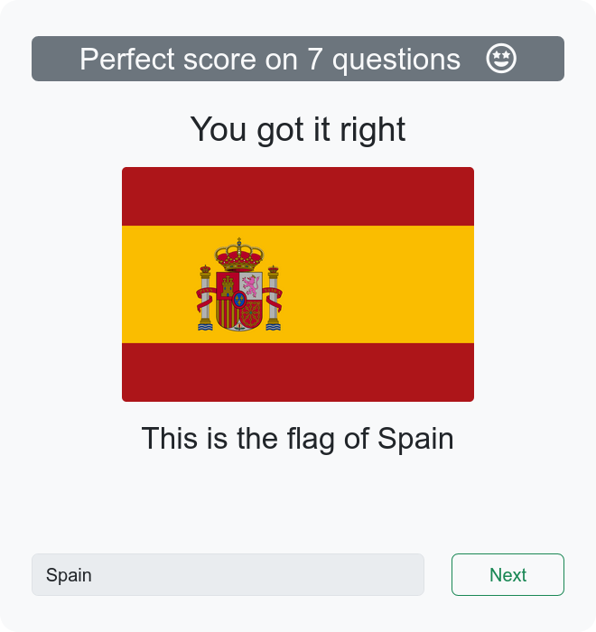
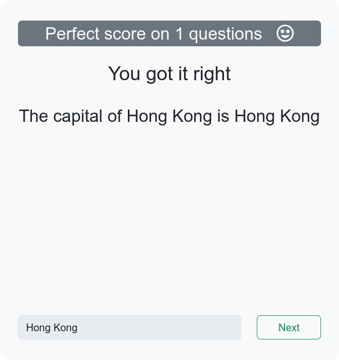
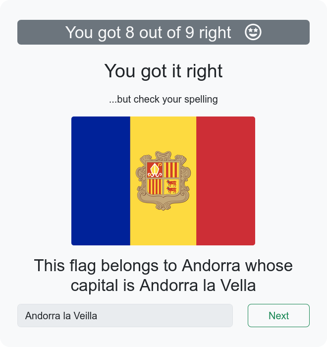
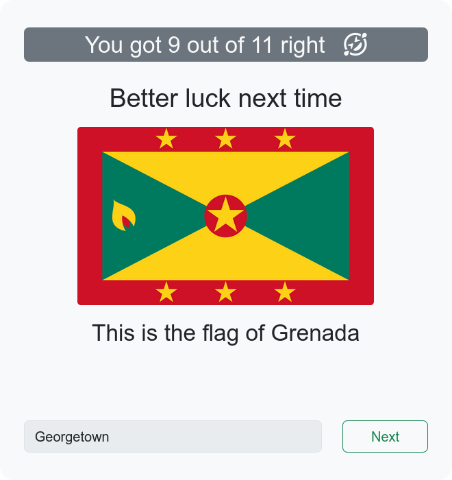
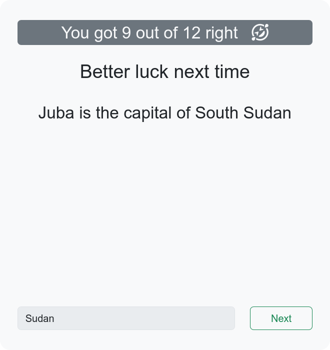

# phpFlags
A flag quiz Web app written in php

This is in early development. The GUI is not worth sharing at this time.

The app randomly chooses between four types of quizzes, then chooses a random question from each quiz question list.
- Guess country from flag
- Guess capital from flag
- Guess capital from country
- Guess country from capital

The app runs currently with no database needed to store quiz question details. All quiz data is stored in the 'countries.json' file as JSON data, from which questions are accessed in PHP files using jQuery with the help of Handlebars templates.

## Planned development
After working out the feedback and GUI, I will add SQL to store user data that will track learning progress for each country and enable users to return and review their what they have learned.

## Gallery

### Start Quiz - sample question for Guess capital city name from country

### Quiz Question - Guess country from flag

### Quiz question - Guess capital city name from flag

### Quiz question - Guess country from capital city name

### Feedback on country name guess from flag

### Feedback on capital city name guess from country - showing perfect score

### Feedback on capital city name guess from flag - misspelling 

### Feedback on country name guess from flag - wrong guess

### Feedback on country name guess from capity city name - wrong guess
